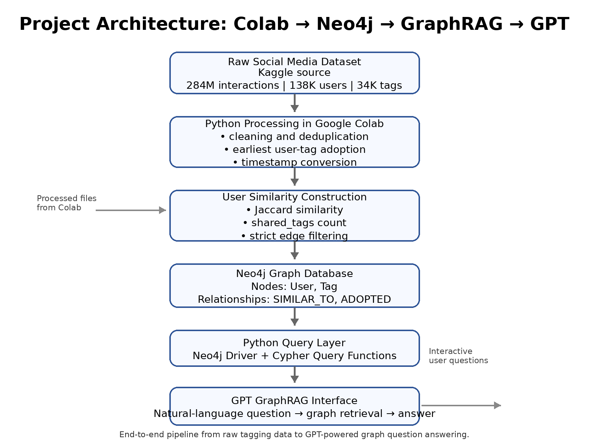
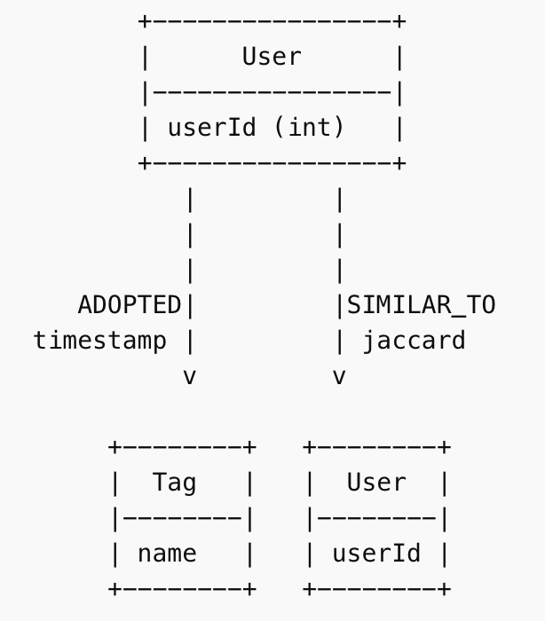
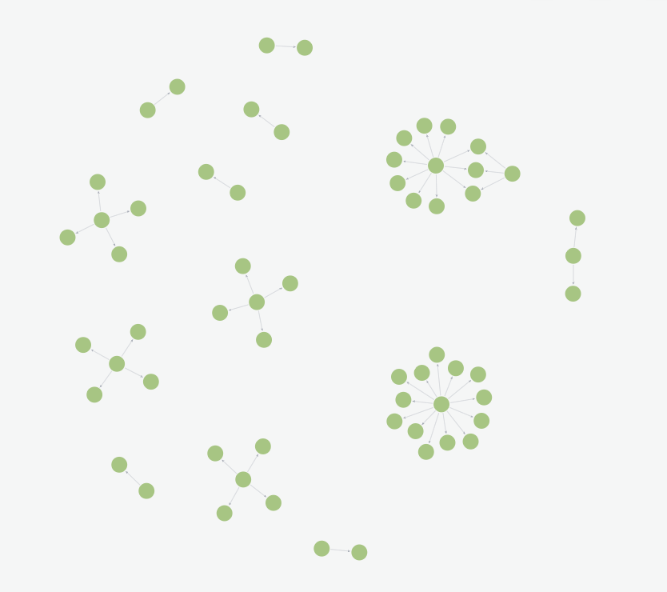
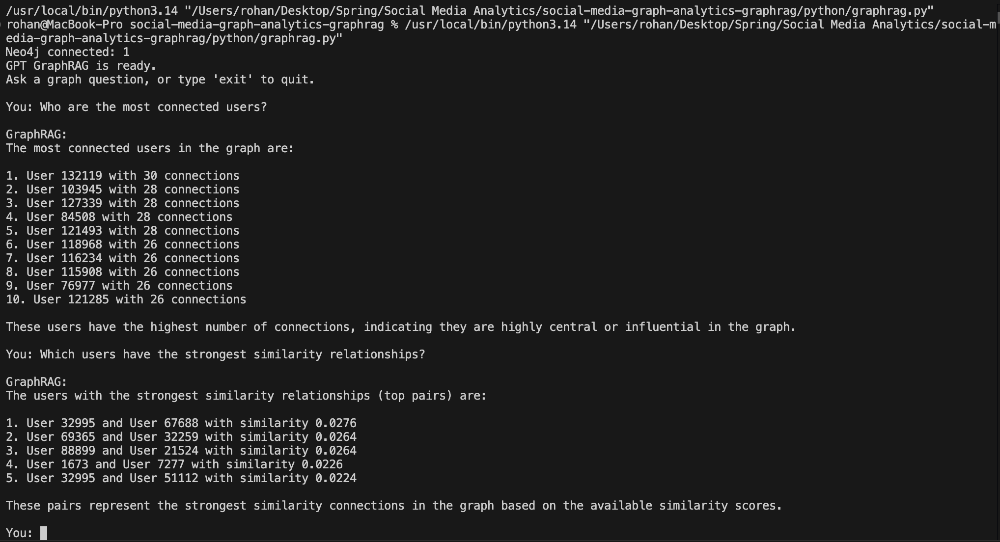

# Social Media Graph Analytics with GraphRAG

This project analyzes user behavior in a social media tagging system using **graph analytics and GraphRAG**.

The system builds a **user similarity network** based on shared tag adoption and studies **homophily and influence patterns** in the network.

The project integrates:

- Python data processing
- Neo4j graph database
- Graph similarity modeling
- GPT-powered GraphRAG querying

The final system allows users to **ask natural language questions about the graph and retrieve insights interactively**.

---

# Dataset

This project uses a **social media tagging dataset**.

Dataset Source:  
[Kaggle Dataset Link]

The dataset contains user interactions with tags over time.

### Dataset Statistics

| Metric | Value |
|------|------|
| Total interactions | ~284 million |
| Unique users | 138,287 |
| Unique tags | 34,175 |

Each record contains:
User ID | Tag | Timestamp

The raw dataset is **not included in this repository** due to its large size.

The notebook in `notebooks/` reproduces the full **data preprocessing and graph construction pipeline**.

---

# Project Workflow

The project follows this pipeline:

1. Data preprocessing in Python (Google Colab)
2. Construction of user similarity graph using Jaccard similarity
3. Graph filtering to retain strong similarity relationships
4. Homophily and influence analysis
5. Graph storage in Neo4j
6. Python integration with Neo4j
7. GraphRAG system using GPT API for natural language querying

---

# Project Architecture

The system combines **large-scale data processing, graph analytics, and AI-powered graph querying**.

### Architecture Components

1. **Data Processing (Python / Colab)**  
   Large-scale preprocessing and similarity computation.

2. **Graph Construction**  
   Build user similarity network based on tag overlap.

3. **Neo4j Graph Database**  
   Store and query the social network.

4. **Python Graph Query Layer**  
   Connects Neo4j with the GraphRAG interface.

5. **GPT API Integration**  
   Converts natural language questions into graph queries.

---

# Graph Model

The system models the social network using **two node types and two relationships**.

## Nodes

### User

Represents a social media user.
User {
userId
}

### Tag

Represents a hashtag or topic adopted by users.
Tag {
name
}

---

## Relationships

### ADOPTED

Represents when a user adopted a tag.
(User)-[:ADOPTED {timestamp}]->(Tag)

---

### SIMILAR_TO

Represents similarity between users based on shared tag usage.
(User)-[:SIMILAR_TO {jaccard, shared_tags}]->(User)

Edge properties:

| Property | Description |
|------|------|
| jaccard | similarity score between users |
| shared_tags | number of tags used by both users |

---

# Graph Schema

The Neo4j graph schema representing users, tags, and similarity relationships.

---

# User Similarity Network

The similarity graph reveals clusters of users connected by shared tag adoption behavior.

Nodes represent users and edges represent `SIMILAR_TO` relationships based on Jaccard similarity.

Clusters indicate groups of users with **similar interests**, while highly connected nodes represent **hub users** in the network.

---

# GraphRAG System

The system integrates **GPT with Neo4j** to allow natural language queries over the graph.

Users can ask questions such as:

- Who are the most connected users?
- Which users share the strongest similarity?
- Tell me about user 132119

### GraphRAG Pipeline

User Question
↓
GPT interprets question
↓
Graph tool selected
↓
Cypher query executed in Neo4j
↓
Results returned
↓
GPT generates explanation

Example interaction:

---

# Key Results

### Homophily Analysis

Homophily Lift ≈ **1.04**

This indicates that users connected in the similarity graph share **slightly more behavioral similarity than random user pairs**.

### Influence Analysis

Influence Lift ≈ **5.42**

This indicates **strong evidence that users influence each other's tag adoption behavior**.

Users are significantly more likely to adopt tags previously used by their neighbors.

---

# Repository Structure
social-media-graph-analytics-graphrag
│
├── notebooks
│ └── Social_Medial_Final_Updated.ipynb
│
├── python
│ └── gptapi.py
│
├── diagrams
│ ├── architecture.png
│ ├── graph_schema.png
│ ├── network_visualization.png
│ └── graphrag_demo.png
│
├── README.md
├── requirements.txt

---

# Technologies Used

- Python
- Pandas
- NumPy
- Neo4j
- Cypher Query Language
- OpenAI GPT API
- GraphRAG Architecture

---

# Author

**Rohan Chimne**  
MS Business Analytics  
McCombs School of Business  
University of Texas at Austin

---

# Demo

Example interaction with the GraphRAG system:

User: Who are the most connected users?

GraphRAG:
User 132119 – 30 connections
User 103945 – 28 connections
User 127339 – 28 connections

The system converts natural language questions into **Cypher queries executed on the Neo4j graph database**.
